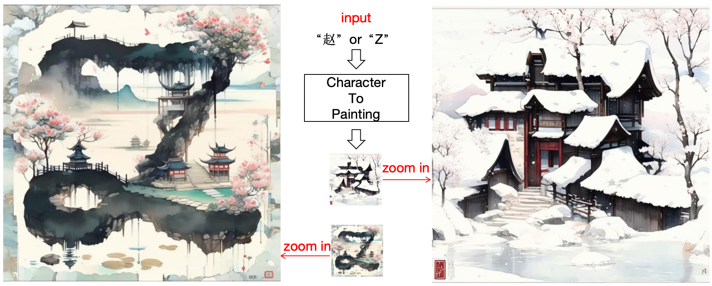
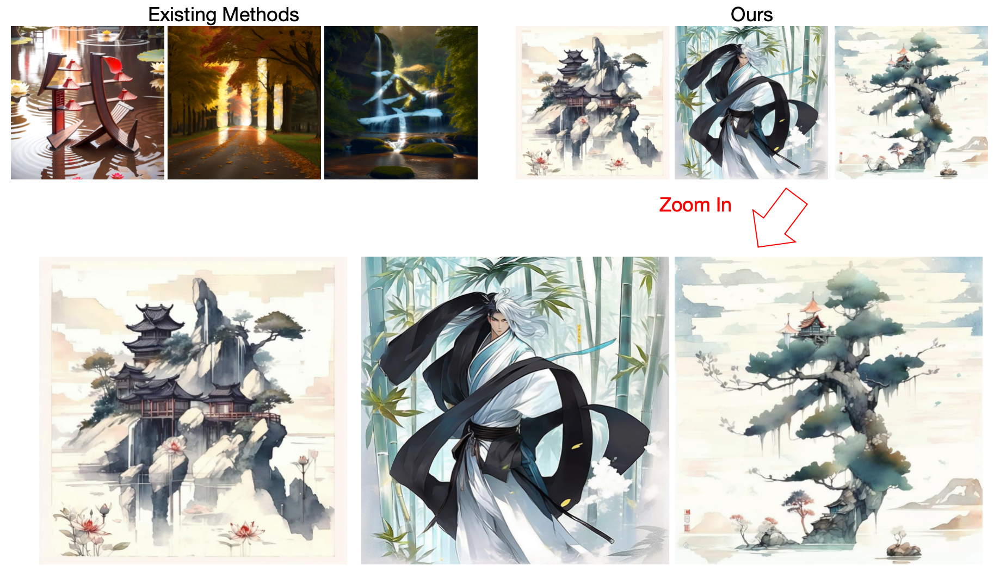
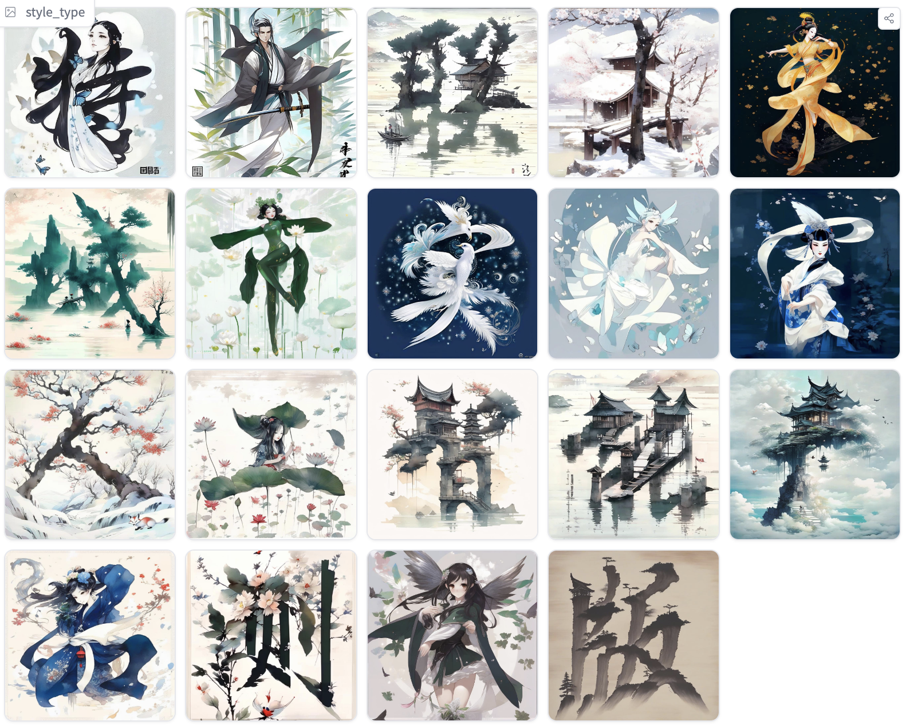

# X2Painting
Given a character input, such as “赵” or “Z”, the model output a image in the 1024x1024 resolution.
**Zoom out** the image, it contain the shape of the character.
**Zoom in** the image, it is a painting

## Introduction

Artistic typography has been widely discussed in many academic papers. Existing methods preserving the outlines of text and then utilizing text prompt to control the  diffusion models to render artistic fonts. Although the resulting text possesses aesthetic appeal and blends well with the background, the text outline does not merge seamlessly  to form a cohesive painting; it remains recognizable as artistic typography rather than a complete artwork.

Our approach use the outlines of text to create paintings by blended the shape of the text into the painting. It enables the image generated by the diffusion model contains the shape of the text and the aesthetic logic of the painting.
It can be called as, Zoom out, it is a character, Zoom in, it is a painting, As shown in Fig.1

## HuggingFace Demo
https://huggingface.co/spaces/AntaresGuo/X2Painting

### User Tips
- input a character, such as “赵” or “Z”
- select a style
- run and enjoy 😄 

### Support styles
Now, we support 19 styles

## Future

- The code will coming soon
- support multiple language and character
- support more styles including user uploaded styles