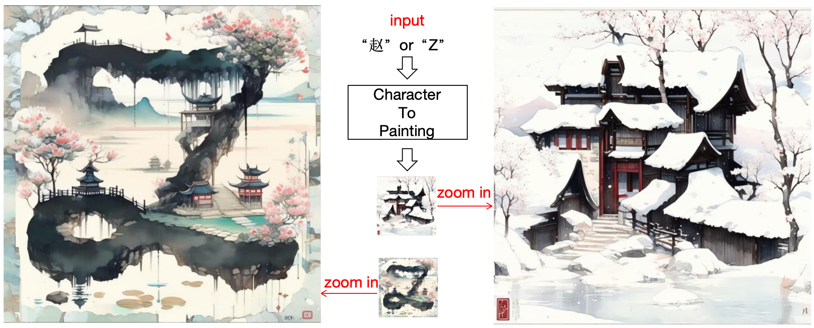

# X2Painting
## Character <--- Zoom out⭐️⭐⭐⭐⭐Zoom in ---> Painting

This is the implementation of the X2Painting.

The code will coming soon

## HuggingFace Demo
https://huggingface.co/spaces/AntaresGuo/X2Painting

